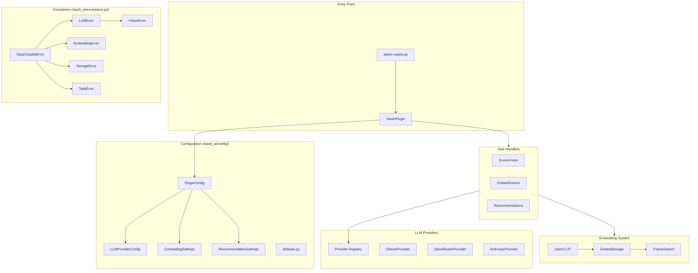

# CLAUDE.md

This file provides guidance to Claude Code (claude.ai/code) when working with code in this repository.

## Architecture Diagram

**Last Updated:** 2026-02-15

```
See: docs/diagrams/architecture-post-cleanup.mmd
```



> **IMPORTANT**: When making structural changes to the codebase (adding/removing modules, changing data flow, modifying provider patterns), you MUST update this diagram and the full diagram at `docs/diagrams/architecture-post-cleanup.mmd`.

## Development Workflow

Two-branch model: **main** (production, protected) and **dev** (default integration branch). Always branch features from `dev`, merge back to `dev`, and periodically merge `dev` → `main` for releases. Delete feature branches after merge. PRs are optional (single-developer project) but recommended for major features or breaking changes.

## Python

This project uses UV to manage python. There should be a venv in this project to use. Any python commands should be using UV. Pip should only ever be used if all other options have been exhausted.

### Typing
This project uses strict typing. Everything should be appropriately typed in order for the application to be easier understood, both by humans and AI. For example, using `TypedDict`, or typing all the keys and values recursively.

## Logs

**Log file**: `~/.stash/stash.log`

Plugin logs are JSON formatted (`{"output": "message", "level": "info"}`). Filter with `grep -i "copilot\|stash_ai"`. Levels: trace, debug, info, warning, error. Use `self.log(msg, level)` for output, `self.progress(current, total)` for progress bars.

## Testing

Testing is performed with Playwright via MCP tools. **All new features MUST be tested before merge.**

**Requirements:**
1. Save screenshots to `tests/screenshots/` -- **always use absolute paths** (`~/.stash/plugins/stash-copilot/tests/screenshots/...`) because Playwright MCP prepends `.playwright-mcp/` to relative paths
2. After every UI interaction, check logs for errors: `grep -i "error\|exception\|traceback\|failed" ~/.stash/stash.log`
3. For long-running tasks (embedding, AI analysis): **wait for completion** in logs before declaring success. Monitor with `tail -f`. If >2 minutes, inform the user of progress. Never assume a started task succeeded. **While waiting, actively monitor system resources per the user-level CLAUDE.md guidelines** — check memory/CPU every 30-60s and alert if thresholds are exceeded. Do not passively wait if a process appears stuck or is consuming excessive resources.

## Project Overview

**Stash Copilot** is a plugin for [StashApp](https://github.com/stashapp/stash) that aggregates Stash data (SQLite DB, sprites, video previews, play stats, tags, funscripts) and passes it to LLMs for AI-powered insights and actions. Python backend triggered by Stash tasks/hooks. LLM providers must be modular (Ollama, Llama.cpp, OpenRouter, OpenAI, Anthropic, Google). All embeddings stored locally.

## Commands

```bash
# Install dependencies
uv sync

# Run tests
pytest

# Test plugin standalone (will fail without stdin, but checks imports)
uv run python stash-copilot.py
```

## Architecture

### Entry Point Flow
1. Stash executes `stash-copilot.py` with JSON input via stdin
2. `StashPlugin` base class parses input and initializes `StashInterface` (from stashapi library)
3. `StashCopilotPlugin.run()` dispatches to task handlers based on `args.mode`
4. For AI tasks, `StatsSummaryTask` aggregates data and calls LLM provider

### Key Components

**stash-copilot.py** - Plugin entry point
- `StashPlugin` - Base class handling Stash connection, logging (`self.log(msg, level)`), progress reporting
- `StashInterface` (from stashapi) - Official Stash API client, handles auth automatically when passed `server_connection`

**stash_ai/** - AI functionality package
- `config/` - Typed configuration module
  - `defaults.py` - Centralized default values
  - `settings.py` - Typed dataclasses (`PluginConfig`, `LLMProviderConfig`, etc.)
  - `legacy.py` - Backwards compatibility (`LLMConfig`, `LLMSettings`)
- `exceptions.py` - Typed exception hierarchy (`StashCopilotError`, `LLMError`, etc.)
- `data/aggregators.py` - `LibraryStatsAggregator` collects statistics for LLM prompts
- `data/queries.py` - GraphQL query definitions
- `llm/` - Provider abstraction with `@register_provider` decorator pattern
- `tasks/stats_summary.py` - Orchestrates data collection → LLM → output
- `tasks/scene_vision.py` - Vision analysis of scene sprite sheets with follow-up chat
- `tasks/xml_parser.py` - XML parsing utilities for structured LLM responses
- `tools/` - Database query tools for agentic LLM interactions

### LLM Provider Pattern
Providers register via decorator and are instantiated by factory:
```python
@register_provider("ollama")
class OllamaProvider(BaseLLMProvider):
    ...

# Usage
llm = get_provider(config.llm)
response = llm.complete(prompt)
```

### Embedded Frames Directory

`assets/embedded_frames/` stores extracted video frames (1 FPS JPEG). **Only `standalone_embed.py` and `stash_ai/tasks/embed_scenes.py` may write here** -- all other tasks are read-only to maintain embedding integrity.

### VLM Registration

Vision support is keyword-matched in each provider's `VISION_KEYWORDS` set. To add a new VLM, add its identifying keyword to `VISION_KEYWORDS` in `stash_ai/llm/providers/ollama.py` or `openrouter.py`. Model capabilities (resolution, context window, grid mode) are in `stash_ai/llm/model_caps.py`. Prompt selection keywords are in `stash_ai/tasks/scene_vision.py`.

### Debug Logging

Set `STASH_COPILOT_DEBUG=1` to enable verbose LLM provider logging. Note: the "images not sent" warning always appears (unconditional) when vision is misconfigured.

### Recommendation System

**Location**: `stash_ai/recommendations/`

Engagement scoring: `score = (o_count * 20) + (replays * 2) + (play_hours * 1) + (stars * 1.5)`. Also supports `time_decayed` mode with exponential half-life decay.

Three modes: **Discover** (unwatched scenes similar to user profile), **Re-watch** (watched scenes ranked by engagement + similarity), **Peak Moments** (O-marker frame embeddings, requires "Embed O-Moments" task).

For detailed schemas, output formats, and settings, see `docs/REFERENCE.md`.

## Stash Connection

All Stash API calls go through `StashInterface` from the stashapi library. The `StashInterface` is initialized once in `StashPlugin.__init__()` with the `server_connection` fragment from Stash, which handles authentication automatically.

Tasks receive the `StashInterface` instance directly - they don't create their own connections.

Data pulled for this application should only use the sqlite database, not the graphql endpoint. Querying the database should only be done through the `StashInterface` object from the stashapi library, if possible.

## Performance Expectations & Budgets

Task performance should be monitored against these budgets. When a task exceeds its budget, it is a signal that optimization is needed — file an issue or fix it before merging.

### Task Performance Budgets

| Task | Expected Duration | Peak Memory (RSS) | Notes |
|---|---|---|---|
| Embed Scenes (per scene) | < 5s per frame batch | < 3 GB | OpenCLIP model load is one-time; subsequent scenes should reuse |
| Embed Scenes (full library) | < 2 min per 100 scenes | < 4 GB | If > 4 GB, batch size is too large |
| Scene Vision (single scene) | < 30s (excluding LLM wait) | < 2 GB | Sprite sheet decode + grid assembly |
| Stats Summary | < 10s (excluding LLM wait) | < 500 MB | Pure data aggregation, no ML models |
| Recommendations | < 15s for top-N | < 2 GB | Embedding similarity search |
| Tag Vocabulary Build | < 30s | < 1 GB | One-time vocabulary construction |
| Preference Session (pair selection) | < 5s | < 1 GB | Should be near-instant |
| Plugin startup (import + init) | < 3s | < 200 MB | No model loading at startup |

### When Performance Must Be Improved

Fix performance issues **before merging to dev** if ANY of these are true:

1. **Memory**: Task RSS exceeds its budget by > 50% (e.g., a 2 GB budget task hitting 3+ GB)
2. **Duration**: Task takes > 3x its expected duration on the development machine (16 cores, 64 GB RAM)
3. **Scaling**: Performance degrades worse than O(n) with input size (e.g., doubling scenes more than doubles time)
4. **Startup**: Plugin import/initialization adds > 1s of latency to Stash task dispatch
5. **Leaks**: Memory grows unboundedly across repeated task invocations (process RSS never stabilizes)
6. **Blocking**: A task blocks the Stash UI or prevents other tasks from running

### Performance Investigation Checklist

When a performance issue is identified:

1. **Profile first**: Use `py-spy`, `memray`, or `tracemalloc` to identify the bottleneck — do not guess
2. **Check batch sizes**: Many tasks process items in batches; reducing batch size trades speed for memory
3. **Check model loading**: Verify models are loaded once and reused, not reloaded per-scene
4. **Check data copying**: Large tensors/arrays should not be unnecessarily copied (use views/slices)
5. **Check I/O patterns**: Database queries should be batched, not issued per-scene in a loop
6. **Log the fix**: Add a brief comment near the optimization explaining why (so it isn't "cleaned up" later)

### Profiling Commands

```bash
# Memory profiling (requires: uv pip install memray)
uv run memray run -o profile.bin stash-copilot.py
uv run memray flamegraph profile.bin

# CPU profiling (requires: uv pip install py-spy)
uv run py-spy record -o profile.svg -- python stash-copilot.py

# Quick peak memory of a command
/usr/bin/time -v uv run python stash-copilot.py 2>&1 | grep "Maximum resident"
```

## Scene Page UI Architecture

The plugin extends Stash's scene page by injecting four AI tabs into the native sidebar: **Analyze**, **Similar**, **Recs**, **Tags** (in `stash-copilot.js`). All sidebar CSS classes use the `stash-copilot-sidebar-*` prefix. Scene cards use a unified component system via `buildSceneCard()` / `setupSceneCardEvents()` with CSS custom property theming (`--card-accent`, `--card-accent-rgb`). New themes are added with `[data-theme="name"]` selectors. UI style: modern AI aesthetic (glows, gradients, animations).

## UI Interaction Feedback Principle

**Every user interaction MUST produce instant, informative, and live-updating feedback.** This is a non-negotiable design requirement for all UI work in this project.

### Rules

1. **Instant** — The UI must respond within one frame (~16ms) of the user's action. If the operation is async, show a loading/progress state immediately (spinner, skeleton, status text) before the backend responds.
2. **Informative** — Feedback must tell the user *what is happening*, not just *that something is happening*. Prefer `"Merging 'Tag A' into 'Tag B'…"` over `"Loading..."`. Include specifics: tag names, scene counts, file names, progress percentages.
3. **Live-updating** — For multi-step or polling operations, the UI must update continuously as progress occurs. Show intermediate states (polling dots, progress bars, step counts), not just start → end.

### Patterns to Follow

| Interaction | Immediate Feedback | During Operation | On Complete |
|---|---|---|---|
| Button click | Disable button + show spinner/status | Status text with specifics | Success/error flash, then advance |
| Keyboard shortcut | Visual highlight on triggered element | Same as button | Same as button |
| Task trigger | Loading state with descriptive text | Poll results, update status | Render results or error |
| Navigation | Replace page content immediately | Show loading skeleton if data needed | Render full page |

### Anti-Patterns (never do these)

- Silent operations — user clicks and nothing visibly changes for >200ms
- Generic "Loading..." with no context about what's loading
- Fire-and-forget — triggering a backend task with no polling or status indicator
- Error swallowing — `catch (e) { /* ignore */ }` with no user feedback

## Agent skills

Configuration the engineering skills (`to-issues`, `to-prd`, `triage`, `qa`,
`diagnose`, `tdd`, `improve-codebase-architecture`, `zoom-out`) read for this repo.

### Issue tracker

GitHub Issues on `thrway1681/stash-copilot`, via the `gh` CLI. **`gh` MUST be
authenticated as the `thrway1681` pseudonym, never the personal account** — verify
with `gh api user --jq .login` before any write. See `docs/agents/issue-tracker.md`.

### Triage labels

Canonical five-role vocabulary (`needs-triage`, `needs-info`, `ready-for-agent`,
`ready-for-human`, `wontfix`). See `docs/agents/triage-labels.md`.

### Domain docs

Single-context. `CONTEXT.md` + `docs/adr/` at the repo root (created lazily by
`/grill-with-docs`). See `docs/agents/domain.md`.

