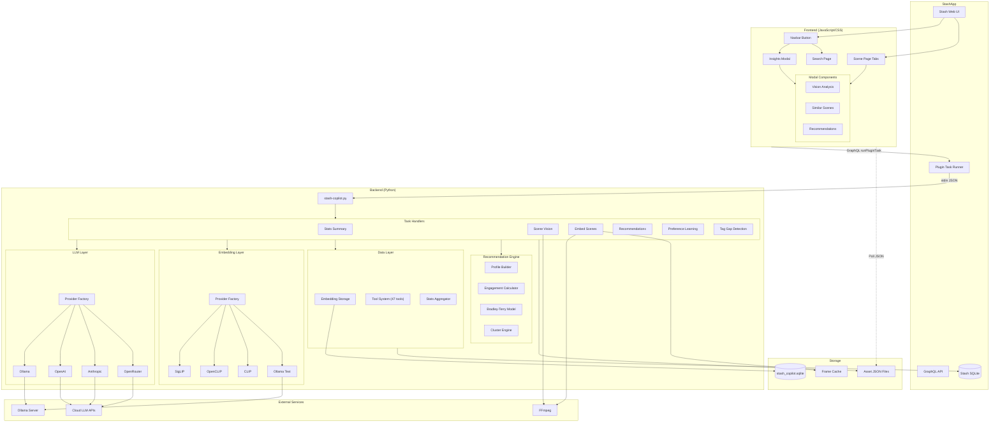
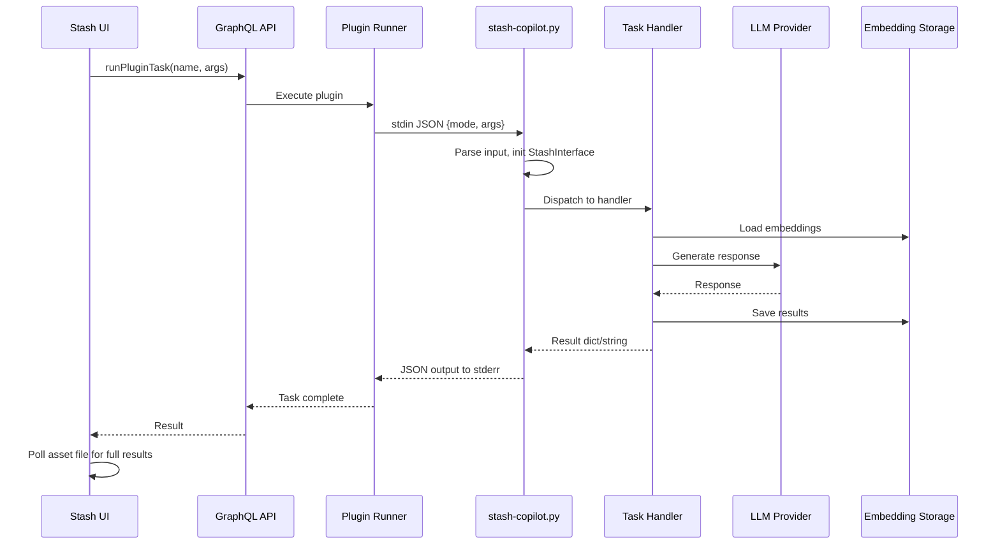
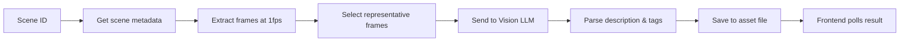
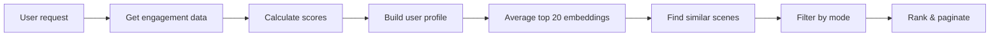
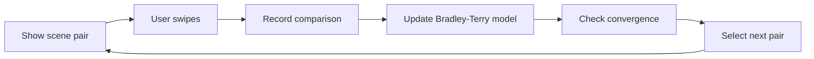

# Stash Copilot Architecture

**Generated:** 2026-02-15
**Version:** 0.1.0

## Overview

Stash Copilot is a plugin for StashApp that provides AI-powered library insights, vision analysis, and personalized recommendations. The plugin consists of a Python backend (~40,740 LOC) and JavaScript/CSS frontend (~26,567 LOC).

## Architecture Diagram



## Component Details

### Entry Point Flow



### Module Structure

```
stash-copilot/
├── stash-copilot.py          # Entry point (StashCopilotPlugin class)
├── stash-copilot.yml          # Plugin manifest (settings, tasks, hooks)
├── stash-copilot.js           # Frontend (15,411 lines)
├── stash-copilot.css          # Styles (11,156 lines)
├── prompts/                   # LLM prompt templates
│   ├── ask/system.yaml
│   ├── chat/system.yaml
│   ├── vision/*.yaml
│   ├── tags/suggestion.yaml
│   └── stats/summary.yaml
├── assets/                    # Runtime data
│   ├── stash_copilot.sqlite   # Embedding database (19 GB)
│   ├── embedded_frames/       # Extracted frame cache
│   └── *.json                 # Task result files
└── stash_ai/                  # Python package (71 files)
    ├── config.py              # LLMConfig dataclass
    ├── llm/                   # LLM provider abstraction
    │   ├── base.py            # BaseLLMProvider ABC
    │   ├── factory.py         # get_provider()
    │   ├── model_caps.py      # VLM capabilities
    │   └── providers/         # Ollama, OpenAI, Anthropic, OpenRouter
    ├── embeddings/            # Embedding system
    │   ├── base.py            # BaseEmbeddingProvider ABC
    │   ├── config.py          # EmbeddingConfig
    │   ├── provider.py        # Factory
    │   ├── storage.py         # SQLite storage
    │   └── providers/         # SigLIP, OpenCLIP, CLIP, Ollama
    ├── tasks/                 # Task implementations (16 classes)
    ├── tools/                 # LLM tools (47 database tools)
    ├── recommendations/       # Recommendation engine
    ├── preferences/           # Preference learning
    ├── data/                  # Data aggregation
    └── prompts/               # Prompt loading
```

## Key Patterns

### 1. Provider Pattern (Factory + Registry)

All LLM and embedding providers use decorator-based registration:

```python
@register_provider("ollama")
class OllamaProvider(BaseLLMProvider):
    ...

# Usage
llm = get_provider(config)  # Returns OllamaProvider instance
```

### 2. Tool Pattern (Schema + Execution)

47 database tools expose schemas for LLM consumption:

```python
class BaseTool(ABC):
    @property
    def name(self) -> str: ...
    @property
    def parameters(self) -> List[ToolParameter]: ...
    def execute(self, params: Dict) -> ToolResult: ...
    def to_schema(self) -> Dict:  # For LLM tool use
```

### 3. Task Pattern (Stateful Executors)

Each task is a class with callbacks:

```python
class XxxTask:
    def __init__(self, stash, llm_config, log_callback, progress_callback):
        ...
    def run(self, **args) -> Dict | str:
        ...
```

### 4. TypedDict Everywhere

Heavy use of TypedDict for type-safe JSON:

```python
class SceneDetails(TypedDict):
    id: int
    title: Optional[str]
    performers: List[Dict]
    tags: List[Dict]
    ...
```

## Data Flow Examples

### Scene Vision Analysis



### Personalized Recommendations



### Preference Learning



## Database Schema Overview

### Primary Tables

| Table | Records | Purpose |
|-------|---------|---------|
| scene_embeddings | 12,812 | Scene-level composite embeddings |
| frame_embeddings | 4,073,927 | Individual frame embeddings |
| frame_embedding_metadata | 12,362 | Frame extraction stats |
| performer_embeddings | 313 | Performer visual embeddings |
| taste_clusters | 15 | User preference clusters |
| preference_comparisons | 1,296 | Learning data |
| tag_embeddings | 507 | Tag text embeddings |
| frame_tag_coverage | 4,073,278 | Tag coverage analysis |

### Schema Version

Current: **10** (migrations handled automatically)

## Frontend Architecture

### State Management

| State Object | Purpose |
|--------------|---------|
| `state` | Global plugin state |
| `visionState` | Vision analysis workflow |
| `searchState` | Semantic search |
| `similarState` | Similar scenes modal |
| `sceneRecsState` | Scene recommendations |
| `sidebarTabState` | Sidebar tabs |
| `preferenceState` | Preference training |

### Component Hierarchy

```
Navbar Button
└── Dropdown Panel
    ├── Summary Tab
    ├── Chat Tab
    ├── Tools Tab
    ├── Recommendations Tab
    ├── Peak Moments Tab
    ├── Taste Map Tab
    └── Train Tab

Scene Page
└── Sidebar Tabs (injected)
    ├── Analyze Tab
    ├── Similar Tab
    ├── Recs Tab
    └── Gaps Tab

Search Page (SPA)
└── Results Grid
```

### Event Flow

1. User clicks navbar button → dropdown opens
2. User selects tab → content lazy-loaded
3. Task triggered → `runPluginTask()` called
4. Frontend polls asset file for results
5. Results rendered in UI
