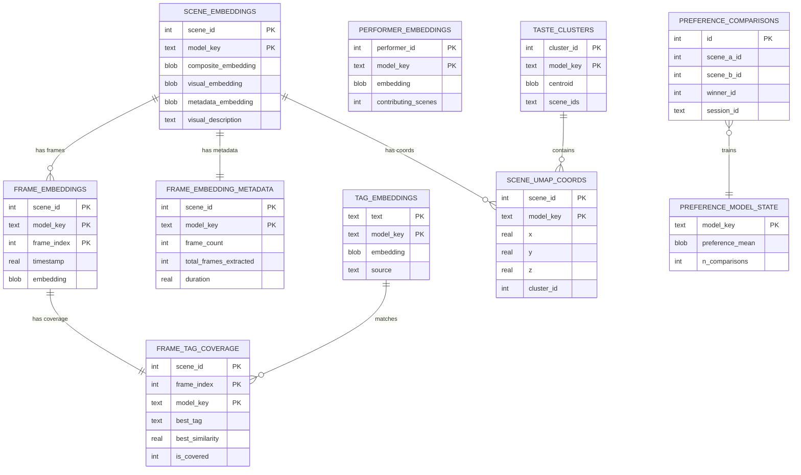

# Database Schema Documentation

**Generated:** 2026-02-15

## Overview

Stash Copilot maintains 3 SQLite databases in `assets/`:

| Database | Size | Schema | Status |
|----------|------|--------|--------|
| `stash_copilot.sqlite` | 19 GB | v10 | **ACTIVE** |
| `stash_copilot_ViT-bigG-14-dense.sqlite` | 204 MB | v4 | Stale (2026-01-18) |
| `stash_copilot_ViT-H-14-sparse.sqlite` | 432 MB | v4 | Stale (2026-01-04) |

## Primary Database: stash_copilot.sqlite

### Table: scene_embeddings

Scene-level embeddings for similarity search and recommendations.

```sql
CREATE TABLE scene_embeddings (
    scene_id INTEGER NOT NULL,
    model_key TEXT NOT NULL,              -- "openclip:ViT-H-14"
    composite_embedding BLOB NOT NULL,    -- Combined visual + metadata
    visual_embedding BLOB,                -- Vision model output
    metadata_embedding BLOB,              -- Text model output
    text_model TEXT,                      -- e.g., "nomic-embed-text"
    visual_model TEXT,                    -- e.g., "ViT-H-14"
    visual_description TEXT,              -- Scene description
    metadata_text TEXT,                   -- Aggregated metadata
    created_at TEXT NOT NULL,
    updated_at TEXT,
    dimensions INTEGER NOT NULL DEFAULT 0,
    PRIMARY KEY (scene_id, model_key)
);
```

**Statistics:** 12,812 scenes | Model: openclip:ViT-H-14

---

### Table: frame_embeddings

Individual frame embeddings at 1 fps.

```sql
CREATE TABLE frame_embeddings (
    scene_id INTEGER NOT NULL,
    model_key TEXT NOT NULL,
    frame_index INTEGER NOT NULL,         -- 0-based index
    timestamp REAL NOT NULL,              -- Seconds
    embedding BLOB NOT NULL,              -- Packed float32
    created_at TEXT NOT NULL,
    PRIMARY KEY (scene_id, model_key, frame_index)
);
CREATE INDEX idx_frame_emb_scene_model ON frame_embeddings(scene_id, model_key);
```

**Statistics:** 4,073,927 frames | 12,760 scenes | ~319 frames/scene average

---

### Table: frame_embedding_metadata

Scene-level frame extraction statistics.

```sql
CREATE TABLE frame_embedding_metadata (
    scene_id INTEGER NOT NULL,
    model_key TEXT NOT NULL,
    frame_count INTEGER NOT NULL,           -- Unique frames after dedup
    total_frames_extracted INTEGER NOT NULL,-- Before deduplication
    duration REAL NOT NULL,                 -- Video seconds
    sampling_rate REAL NOT NULL,            -- Frames per second
    composite_embedding BLOB,               -- Average of frame embeddings
    dedup_ratio REAL DEFAULT 0.0,
    first_frame_timestamp REAL,
    last_frame_timestamp REAL,
    created_at TEXT NOT NULL,
    updated_at TEXT NOT NULL DEFAULT '',
    PRIMARY KEY (scene_id, model_key)
);
```

**Statistics:** 12,362 scenes

---

### Table: performer_embeddings

Aggregated performer embeddings from their scenes.

```sql
CREATE TABLE performer_embeddings (
    performer_id INTEGER NOT NULL,
    model_key TEXT NOT NULL,
    embedding BLOB NOT NULL,
    contributing_scenes INTEGER NOT NULL,
    total_engagement_score REAL NOT NULL,
    visual_description TEXT,
    top_tags TEXT,                          -- JSON array
    scene_count INTEGER NOT NULL,
    created_at TEXT NOT NULL,
    updated_at TEXT NOT NULL,
    PRIMARY KEY (performer_id, model_key)
);
CREATE INDEX idx_performer_embedding_performer_id ON performer_embeddings(performer_id);
CREATE INDEX idx_performer_embedding_model_key ON performer_embeddings(model_key);
```

**Statistics:** 313 performers | Model: openclip:ViT-H-14

---

### Table: taste_clusters

User preference clusters for taste profiling.

```sql
CREATE TABLE taste_clusters (
    cluster_id INTEGER NOT NULL,
    model_key TEXT NOT NULL,
    centroid BLOB NOT NULL,                 -- Cluster center embedding
    scene_ids TEXT NOT NULL,                -- Comma-separated IDs
    engagement_total REAL NOT NULL,
    engagement_share REAL NOT NULL,
    auto_label TEXT NOT NULL,               -- Auto-generated name
    user_label TEXT,                        -- User override
    weight_override REAL,
    excluded INTEGER DEFAULT 0,
    tag_matches TEXT NOT NULL,              -- JSON
    created_at TEXT NOT NULL,
    PRIMARY KEY (cluster_id, model_key)
);
```

**Statistics:** 15 clusters

---

### Table: scene_umap_coords

2D/3D UMAP coordinates for visualization.

```sql
CREATE TABLE scene_umap_coords (
    scene_id INTEGER NOT NULL,
    model_key TEXT NOT NULL,
    x REAL NOT NULL,
    y REAL NOT NULL,
    z REAL NOT NULL DEFAULT 0.0,
    cluster_id INTEGER,
    created_at TEXT NOT NULL,
    PRIMARY KEY (scene_id, model_key)
);
```

**Statistics:** 12,756 scenes

---

### Table: tag_embeddings

Tag text embeddings for gap detection.

```sql
CREATE TABLE tag_embeddings (
    text TEXT NOT NULL,                     -- Tag name
    model_key TEXT NOT NULL,
    embedding BLOB NOT NULL,
    source TEXT NOT NULL,                   -- "user_library" | "llm_generated"
    created_at TEXT NOT NULL,
    PRIMARY KEY (text, model_key)
);
```

**Statistics:** 507 tags

---

### Table: frame_tag_coverage

Frame-level tag coverage analysis.

```sql
CREATE TABLE frame_tag_coverage (
    scene_id INTEGER NOT NULL,
    frame_index INTEGER NOT NULL,
    model_key TEXT NOT NULL,
    best_tag TEXT NOT NULL,                 -- Most similar tag
    best_similarity REAL NOT NULL,          -- 0-1 score
    is_covered INTEGER NOT NULL,            -- Boolean
    PRIMARY KEY (scene_id, frame_index, model_key)
);
CREATE INDEX idx_frame_tag_coverage_scene ON frame_tag_coverage(scene_id, model_key);
CREATE INDEX idx_frame_tag_coverage_uncovered ON frame_tag_coverage(is_covered, model_key);
```

**Statistics:** 4,073,278 frame-tag mappings

---

### Table: preference_comparisons

Binary preference comparisons for learning.

```sql
CREATE TABLE preference_comparisons (
    id INTEGER PRIMARY KEY AUTOINCREMENT,
    scene_a_id INTEGER NOT NULL,
    scene_b_id INTEGER NOT NULL,
    winner_id INTEGER NOT NULL,
    phase TEXT NOT NULL,
    response_time_ms INTEGER,
    session_id TEXT NOT NULL,
    model_key TEXT NOT NULL,
    created_at TEXT NOT NULL
);
CREATE INDEX idx_pref_comp_session ON preference_comparisons(session_id);
CREATE INDEX idx_pref_comp_model_key ON preference_comparisons(model_key);
```

**Statistics:** 1,296 comparisons

---

### Table: preference_model_state

Bradley-Terry preference model state.

```sql
CREATE TABLE preference_model_state (
    model_key TEXT PRIMARY KEY,
    preference_mean BLOB NOT NULL,
    preference_covariance_diag BLOB NOT NULL,
    n_comparisons INTEGER NOT NULL,
    noise_variance REAL NOT NULL,
    phase TEXT NOT NULL,
    updated_at TEXT NOT NULL
);
```

**Statistics:** 1 model state (ViT-H-14)

---

### Table: preference_sessions

Preference learning sessions.

```sql
CREATE TABLE preference_sessions (
    session_id TEXT PRIMARY KEY,
    started_at TEXT NOT NULL,
    completed_at TEXT,
    comparison_count INTEGER DEFAULT 0,
    phase TEXT NOT NULL,
    convergence_avg_sigma REAL
);
```

**Statistics:** 73 sessions

---

### Table: schema_info

Database metadata and configuration.

```sql
CREATE TABLE schema_info (
    key TEXT PRIMARY KEY,
    value TEXT
);
```

**Contents:**
- `version` → `10`
- `tag_gap_threshold_openclip:ViT-H-14` → `0.2666923701763153`

---

## Model Key Convention

All tables use `model_key` for multi-model support:

| Pattern | Example | Provider |
|---------|---------|----------|
| `siglip` | `siglip` | SigLIP |
| `openclip:MODEL` | `openclip:ViT-H-14` | OpenCLIP |
| `clip:MODEL` | `clip:ViT-B-32` | CLIP |

---

## Entity Relationship Diagram



---

## Data Statistics Summary

| Metric | Count |
|--------|-------|
| Scene Embeddings | 12,812 |
| Frame Embeddings | 4,073,927 |
| Unique Scenes (frames) | 12,760 |
| Frame Tag Coverage | 4,073,278 |
| Performer Embeddings | 313 |
| Tag Embeddings | 507 |
| Taste Clusters | 15 |
| Preference Comparisons | 1,296 |
| **Total Rows** | ~8.2M |
| **Database Size** | 19 GB |
