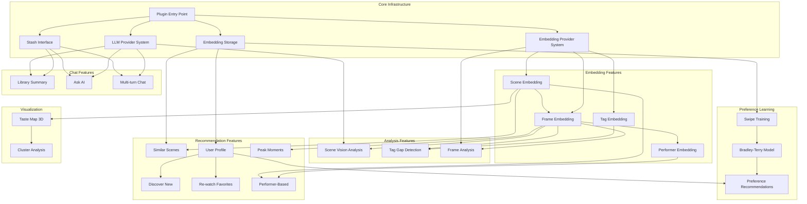

# Feature Documentation

**Generated:** 2026-02-15

## Feature Dependency Graph



## Feature Table

| Feature | Dependencies | Backend Task | Frontend Location | Status |
|---------|--------------|--------------|-------------------|--------|
| **Core Infrastructure** |
| Plugin Entry Point | - | `stash-copilot.py` | - | ✅ Active |
| Stash Interface | Entry Point | stashapi library | - | ✅ Active |
| LLM Provider System | Entry Point | `stash_ai/llm/` | - | ✅ Active |
| Embedding Provider System | Entry Point | `stash_ai/embeddings/` | - | ✅ Active |
| Embedding Storage | Entry Point | `storage.py` | - | ✅ Active |
| **Embedding Features** |
| Scene Embedding | Embedding Provider | `embed_scenes.py` | Tasks UI | ✅ Active |
| Frame Embedding | Scene Embedding | `embed_scenes.py` | Tasks UI | ✅ Active |
| Performer Embedding | Frame Embedding | `embed_performers.py` | Tasks UI | ✅ Active |
| Tag Embedding | Embedding Provider | `tag_vocabulary.py` | - | ✅ Active |
| **Analysis Features** |
| Scene Vision Analysis | LLM, Frame Embedding | `scene_vision.py` | Analyze Tab | ✅ Active |
| Tag Gap Detection | Tag Embedding, Frame Embedding | `tag_gap_detection.py` | Gaps Tab | ✅ Active |
| Frame Analysis | Frame Embedding, Embedding Provider | `frame_analysis.py` | - | ✅ Active |
| **Recommendation Features** |
| Similar Scenes | Scene Embedding, Storage | `find_similar` | Similar Tab/Modal | ✅ Active |
| User Profile | Scene Embedding, Storage | `recommendations.py` | - | ✅ Active |
| Discover New | User Profile | `recommendations.py` | Recs Tab | ✅ Active |
| Re-watch Favorites | User Profile | `recommendations.py` | Recs Tab | ✅ Active |
| Peak Moments | Frame Embedding | `embed_o_moments.py` | Peak Moments Tab | ✅ Active |
| Performer-Based | Performer Embedding | `recommendations.py` | Recs Tab | ✅ Active |
| **Preference Learning** |
| Swipe Training | Storage | `session.py` | Train Tab | ✅ Active |
| Bradley-Terry Model | Swipe Training | `model.py` | - | ✅ Active |
| Preference Recommendations | Bradley-Terry Model | `preference_recs.py` | Train Tab | ✅ Active |
| **Visualization** |
| Taste Map 3D | Scene Embedding | `taste_map.py` | Taste Map Tab | ✅ Active |
| Cluster Analysis | Taste Map | `clusters.py` | Taste Map Tab | ✅ Active |
| **Chat Features** |
| Library Summary | Stash Interface, LLM | `stats_summary.py` | Summary Tab | ✅ Active |
| Ask AI | LLM, Stash Interface | `ask.py` | Tasks UI | ✅ Active |
| Multi-turn Chat | LLM, Stash Interface | `chat.py` | Chat Tab | ✅ Active |
| **Search Features** |
| Semantic Search | Scene Embedding | `search_by_text` | Search Page | ✅ Active |
| Frame-level Search | Frame Embedding | `frame_search.py` | Search Page | ✅ Active |

## Feature Details

### 1. Scene Vision Analysis

**Description:** Analyze scenes using vision-capable LLMs to generate descriptions and tag suggestions.

**How it works:**
1. Extract frames from video at configurable intervals
2. Select representative frames (K-means or smart selection)
3. Send frames to Vision LLM (Gemma 3, LLaVA, GPT-4o, etc.)
4. Parse structured response for description and tags
5. Display suggested tags for quick application

**UI Location:** Scene Page → Analyze Tab

**Dependencies:**
- Scene Embedding (optional, for smart frame selection)
- Frame Embedding (for representative frames)
- LLM Provider (vision-capable model)

---

### 2. Similar Scenes

**Description:** Find scenes visually and contextually similar to the current scene.

**How it works:**
1. Get current scene's visual + metadata embeddings
2. Blend embeddings based on slider weight (default 70% visual)
3. Compute cosine similarity against all scene embeddings
4. Filter by exclusions (performers, tags)
5. Return paginated results

**UI Location:** Scene Page → Similar Tab, Similar Modal

**Dependencies:**
- Scene Embedding (required)
- Embedding Storage

---

### 3. Personalized Recommendations

**Description:** Suggest scenes based on user engagement patterns.

**Modes:**
- **Discover New:** Unwatched scenes similar to user taste profile
- **Re-watch:** Watched scenes ranked by engagement + similarity
- **Peak Moments:** Scenes with similar O-moment content

**How it works:**
1. Calculate engagement scores: `(o_count × 20) + (replays × 2) + (hours × 1) + (stars × 1.5)`
2. Build user profile from top 20 engaged scenes (weighted average)
3. Find similar scenes via cosine similarity
4. Filter by mode (watched/unwatched)
5. Rank by combined score

**UI Location:** Scene Page → Recs Tab, Insights Modal → Recs Tab

**Dependencies:**
- Scene Embedding (required)
- Embedding Storage
- User engagement data (from Stash database)

---

### 4. Preference Learning (Swipe Training)

**Description:** Learn user preferences through swipe comparisons to improve recommendations.

**How it works:**
1. Present scene pairs for comparison
2. User swipes like/dislike/super-like/skip
3. Update Bradley-Terry preference model (Bayesian)
4. Track convergence (confidence metric)
5. Generate preference-weighted recommendations

**Phases:**
- **BROAD:** Inter-cluster comparisons (exploration)
- **REFINE:** Intra-cluster comparisons (refinement)
- **BOUNDARY:** Uncertainty sampling (edge cases)

**UI Location:** Insights Modal → Train Tab

**Dependencies:**
- Scene Embedding
- Embedding Storage
- Bradley-Terry Model

---

### 5. Taste Map 3D

**Description:** 3D visualization of embedding space with cluster analysis.

**How it works:**
1. Load all scene embeddings
2. Apply UMAP dimensionality reduction (to 3D)
3. Cluster via K-means (optimal k by silhouette)
4. Label clusters by matching tags
5. Render 3D scatter plot with Plotly.js

**UI Location:** Insights Modal → Taste Map Tab

**Dependencies:**
- Scene Embedding
- UMAP coordinates (cached)
- Cluster analysis

---

### 6. Tag Gap Detection

**Description:** Identify visual content not covered by existing tags.

**How it works:**
1. Compare frame embeddings against tag embeddings
2. Find frames with low tag similarity (below threshold)
3. Identify uncovered performers and content types
4. Suggest missing tags with quick-add buttons

**UI Location:** Scene Page → Gaps Tab

**Dependencies:**
- Frame Embedding
- Tag Embedding
- frame_tag_coverage table

---

### 7. Multi-turn Chat

**Description:** Interactive chat with AI about your library using database tools.

**How it works:**
1. User sends message
2. LLM processes with tool access (47 database tools)
3. LLM calls tools to query library data
4. LLM generates response with tool results
5. Display tool calls for transparency

**UI Location:** Insights Modal → Chat Tab

**Dependencies:**
- LLM Provider
- Tool System (47 tools)
- Stash Interface

---

### 8. Semantic Search

**Description:** Search scenes using natural language queries.

**How it works:**
1. Convert query to embedding (via text model)
2. Find similar scene embeddings
3. Option for frame-level search (more precise)
4. Return paginated results with pagination

**UI Location:** Search Page (SPA)

**Dependencies:**
- Scene/Frame Embedding
- Text Embedding (Ollama or cloud)

---

## Engagement Scoring Formula

Used by recommendations and profile building:

```
base_score = (o_count × 20.0) +      # Highest signal
             (replay_count × 2.0) +   # Views beyond first
             (play_hours × 1.0) +     # Time invested
             (rating_stars × 1.5)     # User rating (if rated)

time_decayed = base_score × 0.5^(days_since_last_played / 30)
```

## LLM Provider Support

| Provider | Vision | Tools | Models |
|----------|--------|-------|--------|
| Ollama | ✅ | ✅ | Gemma 3, LLaVA, Llama 3.2 |
| OpenAI | ✅ | ✅ | GPT-4o |
| Anthropic | ✅ | ✅ | Claude 3/4 |
| OpenRouter | ✅ | ✅ | Multiple |

## Embedding Provider Support

| Provider | Type | Models |
|----------|------|--------|
| SigLIP | Image | google/siglip-base |
| OpenCLIP | Image | ViT-H-14, ViT-bigG-14 |
| CLIP | Image | ViT-B-32, ViT-L-14 |
| Ollama | Text | nomic-embed-text, mxbai-embed-large |
