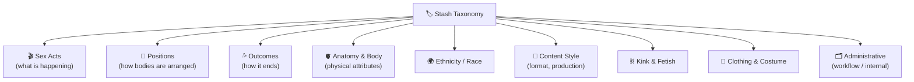
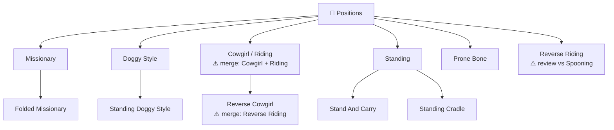
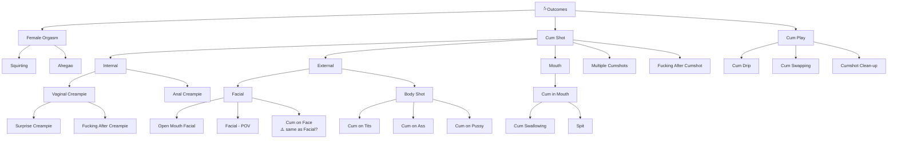
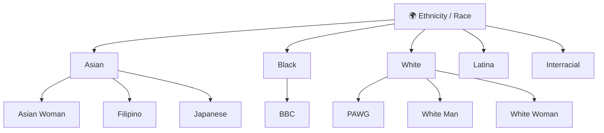
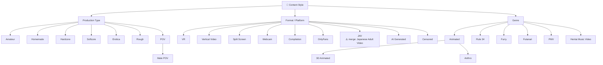
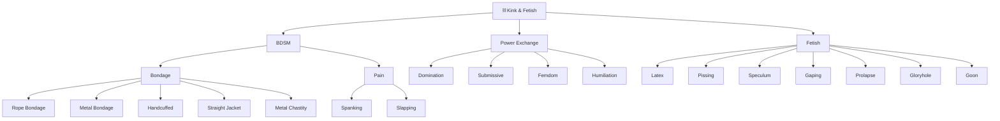
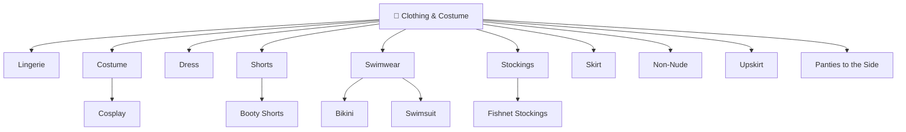

# Tag Taxonomy Proposal

**Generated:** 2026-02-18
**Source:** 316 tags queried from Stash GraphQL API
**Status:** Draft — pending review and confirmation

---

## Current State

| Metric | Count |
|---|---|
| Total tags | 316 |
| Root tags (no parent) | 214 |
| Tags with children | 48 |
| Tags with multiple parents (conflicts) | 32 |
| Completely isolated (no relationships) | 196 |

The existing hierarchy is largely flat — 196 tags have no relationships at all, and 32 tags have conflicting multiple parents that create ambiguous inheritance.

---

## Proposed Architecture: 9 Axes

The core principle: **parent-child relationships only mean "is a more specific type of"**. Cross-axis associations (e.g. anatomy ↔ acts) are represented by co-tagging, not hierarchy.



---

## Axis 1: 🎬 Sex Acts

```mermaid
graph TD
    ACTS["🎬 Sex Acts"]

    ACTS --> SOLO["Solo"]
    ACTS --> PARTNER["Partner Sex"]
    ACTS --> GROUP["Group Sex"]

    SOLO --> MAST["Masturbation"]
    SOLO --> STRIP["Striptease"]
    SOLO --> JOI["Jerk Off Instruction"]
    MAST --> PFING["Pussy Fingering"]
    MAST --> PRUB["Pussy Rubbing"]

    PARTNER --> VAG["Vaginal Sex"]
    PARTNER --> ANAL["Anal Sex"]
    PARTNER --> ORAL["Oral Sex"]
    PARTNER --> OUTER["Outercourse"]
    PARTNER --> LES["Lesbian"]

    VAG --> DVP["Double Vaginal Penetration"]
    ANAL --> ANALPLAY["Anal Play"]
    ANAL --> ANALFIST["Anal Fisting"]
    ANAL --> DAP["Double Anal Penetration"]
    ANAL --> PEG["Pegging / Strap-on"]

    ORAL --> BJ["Blowjob"]
    ORAL --> CUNNI["Cunnilingus\n⚠️ merge: Pussy Eating, Pussy Licking"]
    ORAL --> RIM["Rimming\n⚠️ merge: Ass Eating"]
    ORAL --> FACES["Facesitting"]
    ORAL --> ATM["Ass to Mouth"]
    ORAL --> S69["69"]

    BJ --> DT["Deepthroat"]
    BJ --> FF["Face Fuck"]
    BJ --> GAG["Gag"]
    BJ --> BS["Ball Sucking"]
    BJ --> PL["Penis Licking"]
    BJ --> HFBJ["Hands Free Blowjob"]

    OUTER --> HJ["Handjob"]
    OUTER --> FJ["Footjob"]
    OUTER --> TF["Titfuck"]
    OUTER --> BUTTJ["Buttjob"]
    OUTER --> GRIND["Grinding"]

    LES --> TRIB["Tribbing / Scissoring"]

    GROUP --> THREE["Threesome"]
    GROUP --> ORGY["Orgy"]
    GROUP --> DP["Double Penetration"]
    THREE --> FFM["Threesome (FFM)"]
    ORGY --> GB["Gangbang"]
    DP --> DAP2["DAP"]
    DP --> DVP2["DVP"]
```



---

## Axis 2: 🧍 Positions

> Positions are **orthogonal to acts**. Doggy Style can be vaginal or anal — it belongs here, not as a child of either act.



---

## Axis 3: 💦 Outcomes

> Organized by **where** the cum goes, not which act preceded it. This is why Facial has no act as parent — it can follow any act.



---

## Axis 4: 🫀 Anatomy & Body

> Body part tags and physical attribute tags. These describe **what is present**, not what happens. Never a parent of act tags.

```mermaid
graph TD
    ANAT["🫀 Anatomy & Body"]

    ANAT --> ASS["Ass"]
    ANAT --> BOOBS["Boobs"]
    ANAT --> PUSSY["Pussy"]
    ANAT --> DICK["Dick"]
    ANAT --> MOUTH["Mouth"]
    ANAT --> HAND["Hand"]
    ANAT --> FEET["Feet"]
    ANAT --> BODY2["Body Type"]

    ASS --> ASSHOLE["Asshole"]
    ASS --> BIGASS["Big Ass"]
    ASS --> MEDASS["Medium Ass"]
    ASS --> RNDASS["Round Ass"]
    ASSHOLE --> ACLS["Asshole Closeup"]
    ACLS --> AVCLS["Asshole Very Closeup"]
    BIGASS --> PAWG["PAWG"]
    BIGASS --> PAAG["PAAG"]

    BOOBS --> BIGTITS["Big Tits"]
    BOOBS --> MEDTITS["Medium Tits"]
    BOOBS --> SMTITS["Small Tits"]
    BOOBS --> NATTITS["Natural Tits"]
    BOOBS --> FKTITS["Fake Tits"]
    BOOBS --> SAGTITS["Saggy Tits"]
    BOOBS --> PERTITS["Perfect Tits"]
    BOOBS --> BROWNAR["Brown Areolas"]
    BOOBS --> SMALAR["Small Areolas"]

    PUSSY --> INNIE["Innie"]
    PUSSY --> FATPU["Fat Pussy"]
    PUSSY --> HAIRPU["Hairy Pussy"]
    PUSSY --> SHAVPU["Shaved Pussy"]
    PUSSY --> BRWNPU["Brown Pussy"]
    PUSSY --> PINKPU["Pink Pussy"]
    PUSSY --> PIERCPU["Pierced Pussy"]
    PUSSY --> WETPU["Wet Pussy"]
    PUSSY --> PCLS["Pussy Closeup"]
    WETPU --> VWETPU["Very Wet Pussy"]
    PCLS --> PVCLS["Pussy Very Closeup"]

    DICK --> BIGDCK["Big Dick"]
    DICK --> CONDOM["Condom"]
    DICK --> TIEDP["Tied Penis"]
    BIGDCK --> BBC["BBC"]

    FEET --> TOES["Toes"]

    BODY2 --> PETITE["Petite"]
    BODY2 --> SKINNY["Skinny"]
    BODY2 --> FIT["Fit"]
    BODY2 --> CURVY["Curvy"]
    BODY2 --> WIDEHIP["Wide Hips"]
    BODY2 --> FLATST["Flat Stomach"]
    BODY2 --> SLIMW["slim waist"]
    BODY2 --> PREG["Pregnant"]
    BODY2 --> TAN["Tan"]
    TAN --> TANL["Tan Lines"]
```



---

## Axis 5: 🌍 Ethnicity / Race



> ⚠️ **BBC** appears in both Anatomy (Big Dick) and Ethnicity (Black). It is inherently a combination attribute — consider keeping it as a standalone tag with **aliases** rather than multiple parents.

---

## Axis 6: 🎥 Content Style



---

## Axis 7: ⛓️ Kink & Fetish



---

## Axis 8: 👗 Clothing & Costume



---

## Axis 9: 🗂️ Administrative

> These tags should be **excluded from all embedding similarity calculations**. They are workflow markers, not content descriptors.

```
Administrative
├── Workflow
│   ├── To Embed
│   ├── To Script
│   ├── Embedded
│   ├── Missing Performer (Male)
│   └── [Set Profile Image]
├── Stashbox / Metadata
│   ├── [Stashbox Performer Gallery]
│   ├── [TPDB: Skip Marker]
│   ├── [Timestamp: Skip Sync]
│   └── [MiscTags: Skip]
├── Awards
│   ├── [AVN Award Winner]
│   └── [Award Winner]
├── Funscript Markers
│   ├── Funscript
│   ├── FS: Action
│   ├── FS: Beat
│   ├── Start
│   ├── Free stroke
│   ├── OG beat comes back
│   ├── Funk Beat
│   ├── Funk Beat comes back
│   ├── Jiggle Fuck
│   ├── Hip Sway
│   └── [SIT: Multi-Script]
├── Audio Markers
│   ├── Mixed Audio
│   └── Music Only
├── Events
│   ├── Event 2024
│   └── Event 2025
└── Internal Labels
    ├── Custom Marker A
    ├── Custom Marker B
    ├── HD Available
    └── [SIT: Multi-Script]
```

---

## Tags Needing Decisions

These tags don't cleanly fit one axis or have ambiguities that need your input:

| Tag | Issue | Options |
|---|---|---|
| **Ahegao** | Is it an outcome (expression during orgasm) or an aesthetic/style? | → Female Orgasm (Outcomes) OR → Content Style |
| **Kissing** | General interaction or Lesbian-specific? | → Partner Sex (Acts) standalone OR → Lesbian subtag |
| **Roleplay** | Context/scenario tag — where? | → Content Style → Genre OR its own "Scenario" axis |
| **Schoolgirl / Nurse / Doctor / Massage** | Scenario/costume hybrid | → Clothing (Costume subtree) OR new Scenario axis |
| **Squirting** | Female orgasm outcome or standalone act? | → Female Orgasm (Outcomes) ✓ |
| **Oiled / Oil** | Surface state — clothing axis or standalone? | → Clothing OR standalone modifier |
| **Public Sex** | Location or content style? | → Content Style → Production Type ✓ |
| **Outdoors / Beach / Pool / Gym / Classroom** | Location tags — add a Location axis? | → New "Location" axis OR → Content Style |
| **BBC** | Combination of Big Dick + Black — multi-dimensional | → Keep standalone, add aliases |
| **Curvy** | Combination of Big Ass + Big Tits + Wide Hips | → Keep standalone under Body Type |
| **Gloryhole** | Act (anonymous oral) or fetish/setting? | → Fetish ✓ OR → Oral Sex subtype |
| **Pegging** | Anal penetration with strap-on — act or kink? | → Anal Sex (Acts) ✓ |
| **Facial - POV** | POV is a content style, Facial is an outcome | → Child of Facial (Outcomes) ✓ |

---

## Structural Conflicts to Fix (Multiple Parents)

Pick **one** parent for each — the most semantically specific one:

| Tag | Current parents | Proposed single parent |
|---|---|---|
| **Anal Sex** | Anal, Anal Penetration, Couple Sex | Partner Sex (Acts) |
| **Anal Creampie** | Anal, Anal Sex, Creampie | Internal (Outcomes) |
| **Creampie** | Anal Sex, Cum, Vaginal Sex | Internal (Outcomes) — rename node |
| **Cum** | Dick, Orgasm | Remove entirely — subsumed by Cum Shot |
| **Cum in Mouth** | Cum, Oral Sex | Mouth → Cum Shot (Outcomes) |
| **Cum on Face** | Cum on Person, Orgasm | Facial (Outcomes) — or merge into Facial |
| **DAP** | Anal Sex, Double Penetration | Double Penetration (Acts → Group) |
| **DVP** | Double Penetration, Vaginal Sex | Double Penetration (Acts → Group) |
| **Vaginal Sex** | Couple Sex, Vaginal Penetration | Partner Sex (Acts) |
| **Ass Eating** | Anal, Oral Sex | Rimming (merge as alias) |
| **Ass Closeup** | Ass, Ass Worship, Close Up | Close Up (keep as visual closeup tag) |

---

## Duplicate / Alias Candidates

| Tags | Recommendation |
|---|---|
| Cowgirl + Riding | Merge → **Cowgirl** (Riding as alias) |
| Reverse Cowgirl + Reverse Riding | Merge → **Reverse Cowgirl** (Reverse Riding as alias) |
| Pussy Eating + Pussy Licking + Cunnilingus | Merge → **Cunnilingus** (others as aliases) |
| Rimming + Ass Eating | Merge → **Rimming** (Ass Eating as alias) |
| JAV + Japanese Adult Video | Merge → **JAV** (Japanese Adult Video as alias) |
| Tease + Teasing | Merge → **Tease** (Teasing as alias) |
| Facial + Cum on Face | Decide: are these the same? If yes → merge into **Facial** |

---

## Tags With No Obvious Home (need placement)

These are currently isolated and don't map cleanly to an axis above:

- **Adorable, Playful, Tease, Teasing, Eye Contact, Dirty Talk** — descriptive modifiers; consider a "Mood / Style" axis or leave unparented
- **Dancing, Twerking** — activity before/during sex; could go under Solo (Acts) or Content Style
- **Showering, Washing, Undressing** — pre/post-sex activities; Solo (Acts) or standalone
- **Massage, Massage Table** — scenario tags; consider Location or Scenario axis
- **Lube** — modifier/prop; could go under a "Props" category or standalone
- **Grinding** — placed under Outercourse ✓ already in proposal
- **Vibrator, Vibrating, Dildo, Buttplug, Fucking Machine, Speculum, Sucking Toy/Dildo** — Toys category under Fetish or standalone axis
- **Babes, Thot, Slut, Egirl, Goth** — descriptor/aesthetic tags; your call on whether to formalize
- **Multiple Girls** — Group composition; consider a "Composition" axis (Solo/Couple/Multiple Girls/Group)
- **Teen (18–22), MILF** — Age range; could go under Anatomy → Body or as standalone Performer Type axis
- **Tribute, Goon, Hypno Video** — specific fetish content; → Kink & Fetish
